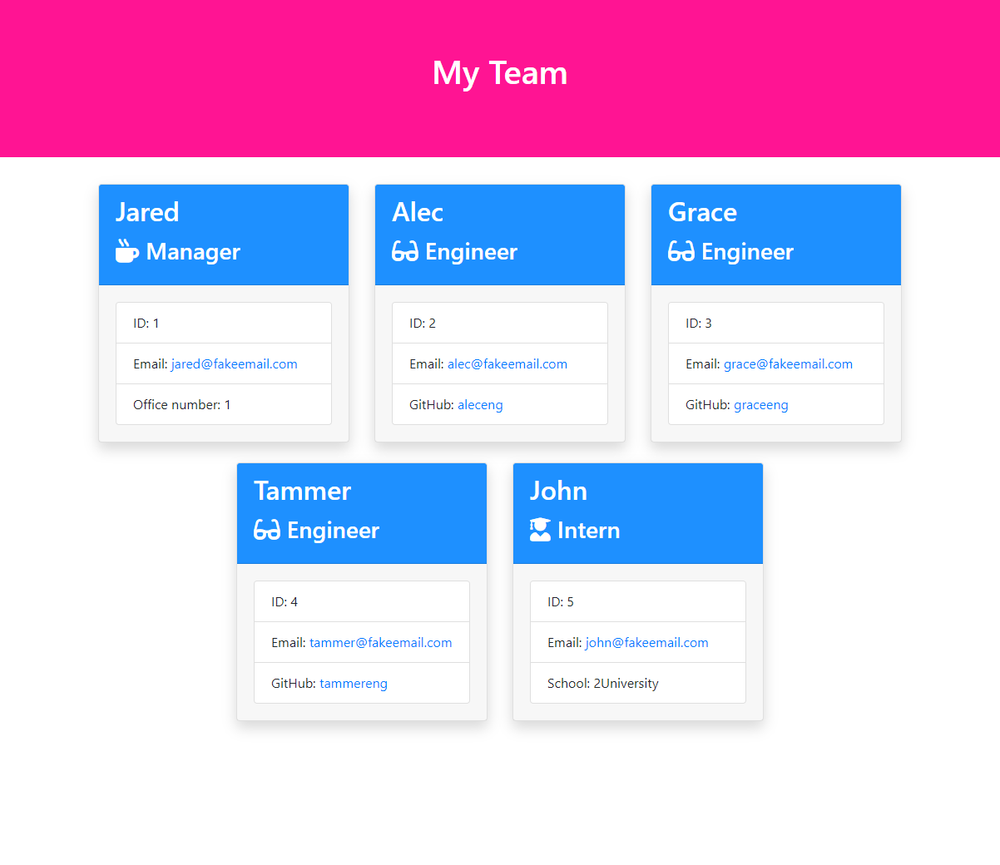

[](https://github.com/willmowlam/nebulus-team-profile-generator/blob/main/LICENSE) &nbsp;
[](https://github.com/willmowlam/nebulus-team-profile-generator) [](https://github.com/willmowlam/nebulus-team-profile-generator) &nbsp;
[](https://github.com/willmowlam/nebulus-team-profile-generator/issues) [](https://github.com/willmowlam/nebulus-team-profile-generator/pulls) &nbsp;
[](https://github.com/willmowlam/nebulus-team-profile-generator) [](https://github.com/willmowlam/nebulus-team-profile-generator)

# Team Profile Generator

A Node.js command-line application to easily create an HTML file containing basic information about your software engineering team.

Click the thumbnail below to see a screenshot example of the rendered html file:

<a href="./assets/images/screenshot.png" alt="Screenshot"></a>

## Table of Contents
1. [Installation](#installation)
2. [Usage](#usage)
3. [Features](#features)
4. [Tests](#tests)
5. [Questions](#questions)
6. [License](#license)

## Installation

To install, run the following command(s) in your terminal:

```
git clone git@github.com:willmowlam/nebulus-team-profile-generator.git
cd nebulus-team-profile-generator
```

## Usage

1. ```node index.js```
2. Answer questions about your team
3. Copy the rendered team.html file and style.css from the output folder

## Features

- Collect input about team members via CLI
- Enter one Manager
- Enter any number of Engineers
- Enter any number of Interns
- Multicolour prompting
- Customizable CSS
- Automatically renders HTML/CSS to output folder
- GitHub Actions Workflow configuration for Node.js testing on merge to main

## Tests

Built and tested with Node.js v20.x

Test classes:

```npm run test```

Create a quick mock team.html file without input:

```node mock.js```

## Questions

If you have any questions, please email [willmowlam.510@icloud.com](mailto:willmowlam.510@icloud.com) or visit my GitHub profile at [https://github.com/willmowlam](https://github.com/willmowlam)

## License

Copyright (c) 2024 Will Mowlam

Team Profile Generator is [MIT licensed](./LICENSE).

